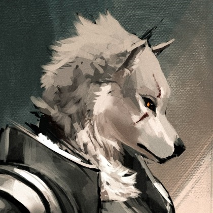

---
{"id":"74371774-f5be-464e-a2ea-cd3ea8bed33f","title":"Arnoud","description":"Once a proud knight of a noble order of paladins, he was the sole survivor of a devastating calamity that befell his comrades.","isActivePartyMember":false,"isAlive":true,"publish":true,"date_created":"Sunday, January 15th 2023, 1:28:30 pm","date_modified":"Friday, April 26th 2024, 11:23:02 pm","editing_lock":false,"live_preview":true,"cssclasses":["mado-heading"],"path":"Tabletop/Campaigns/And A Thousand Years More/Characters/Allies/Arnoud.md","permalink":"/tabletop/campaigns/and-a-thousand-years-more/characters/allies/arnoud/","PassFrontmatter":true}
---

Once a proud knight of a [[Tabletop/Campaigns/And A Thousand Years More/Faction/Misc/Leftovers of the Paladins\|noble order of paladins]], he was the sole survivor of a devastating calamity that befell his comrades. While his heart still ached for the loss of his brothers-in-arms, he was determined to carry on their legacy and seek justice for their untimely demise. He held fast to the hope that one day he might avenge his fallen companions and restore their honor. With his trusty sword at his side, he set off on a quest to right the wrongs that had been done; a lone warrior, determined to bring justice to those who had caused so much pain.

## Description

- Paladin
- Seems to have lost his party members in a catastrophe.
- Has a Blue Guild Badge

## Mentions

- [[Tabletop/Campaigns/And A Thousand Years More/Sessions/Session 002\|Session 002]]: [[Tabletop/Campaigns/And A Thousand Years More/Characters/Allies/Arnoud\|Arnoud]] points [[Tabletop/Campaigns/And A Thousand Years More/Faction/Misc/Party\|us]] to [[Tabletop/Campaigns/And A Thousand Years More/Quests/Completed/Defeat the Gourdlings\|another quest]]: a bunch of [[Tabletop/Campaigns/And A Thousand Years More/Bestiary/Plantlike/Gourdling\|Gourdlings]] are causing trouble to the [[Tabletop/Campaigns/And A Thousand Years More/Location/Towns and Cities/Opeden/Town Ruins\|north]].
- [[Tabletop/Campaigns/And A Thousand Years More/Sessions/Session 001\|Session 001]]: [[Tabletop/Campaigns/And A Thousand Years More/Faction/Misc/Party\|We]] meet [[Tabletop/Campaigns/And A Thousand Years More/Characters/Allies/Arnoud\|Arnoud]] in the [[Tabletop/Campaigns/And A Thousand Years More/Location/Towns and Cities/Opeden/Opeden Tavern\|tavern]].
- [[Tabletop/Campaigns/And A Thousand Years More/Sessions/Session 001\|Session 001]]: [[Tabletop/Campaigns/And A Thousand Years More/Characters/Allies/Arnoud\|Arnoud]] instructed us on guild etiquette.

