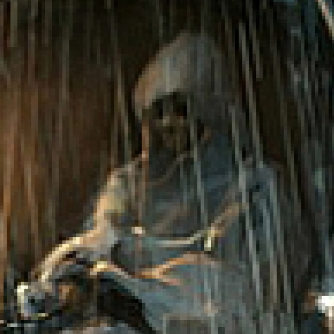

---
{"id":"2e158c9f-c353-419c-9942-4fc238ba9fb8","title":"Leon","description":"The Skunk Coachman was a cowardly figure. He had a penchant for transporting travelers from Opeden to Narre, and, on this fateful day, had the honor of ferrying a group of brave adventurers who had just emerged victorious from a fierce battle against the Bandits who had threatened to hijack his cart.","isActivePartyMember":false,"isAlive":true,"publish":true,"date_created":"Sunday, January 15th 2023, 1:29:04 pm","date_modified":"Friday, April 26th 2024, 11:23:02 pm","editing_lock":false,"live_preview":true,"cssclasses":["mado-heading"],"PassFrontmatter":true}
---

The Skunk Coachman was a cowardly figure. He had a penchant for transporting travelers from [[Tabletop/Campaigns/And A Thousand Years More/Location/Towns and Cities/Opeden\|Opeden]] to [[Tabletop/Campaigns/And A Thousand Years More/Location/Towns and Cities/Narre\|Narre]], and, on this fateful day, had the honor of ferrying [[Tabletop/Campaigns/And A Thousand Years More/Faction/Misc/Party\|a group of brave adventurers]] who had just [[Tabletop/Campaigns/And A Thousand Years More/Quests/Completed/Defeat the Bandits\|emerged victorious from a fierce battle]] against the [[Tabletop/Campaigns/And A Thousand Years More/Faction/Opeden/Bandits of Opeden\|Bandits]] who had threatened to hijack his cart. With a determined glint in his eye, the Skunk Coachman expertly guided his trusty steed towards the distant horizon, leaving the broken remains of the Bandits in the dust.

## Description

- Skunk Coachman.
- Taxied us from [[Tabletop/Campaigns/And A Thousand Years More/Location/Towns and Cities/Opeden\|Opeden]] to [[Tabletop/Campaigns/And A Thousand Years More/Location/Towns and Cities/Narre\|Narre]] after we defeated the Bandits that threatened his cart.

## Mentions

- [[Tabletop/Campaigns/And A Thousand Years More/Sessions/Session 003\|Session 003]]: [[Tabletop/Campaigns/And A Thousand Years More/Characters/Allies/Leon\|Leon]] grins "It's a [[Tabletop/Campaigns/And A Thousand Years More/Location/Towns and Cities/Narre/Narre's Keep\|prison]] my [[Tabletop/Campaigns/And A Thousand Years More/Characters/Party/Lux\|dear]], try not to get stuck there."
- [[Tabletop/Campaigns/And A Thousand Years More/Sessions/Session 003\|Session 003]]: "[[Tabletop/Campaigns/And A Thousand Years More/Faction/Narre/Keep Guards of Narre\|They]] aren't exactly guarding something." [[Tabletop/Campaigns/And A Thousand Years More/Characters/Allies/Leon\|Leon]] says.
- [[Tabletop/Campaigns/And A Thousand Years More/Sessions/Session 003\|Session 003]]: [[Tabletop/Campaigns/And A Thousand Years More/Faction/Misc/Party\|We]] are traveling with [[Tabletop/Campaigns/And A Thousand Years More/Characters/Allies/Leon\|Leon]]'s cart towards [[Tabletop/Campaigns/And A Thousand Years More/Location/Towns and Cities/Narre\|Narre]].
- [[Tabletop/Campaigns/And A Thousand Years More/Sessions/Session 002\|Session 002]]: [[Tabletop/Campaigns/And A Thousand Years More/Characters/Party/Norrix\|Norrix]] walks back to the bar as [[Tabletop/Campaigns/And A Thousand Years More/Characters/Party/Damjan\|Damjan]] ponders. "A free ride and a [[Tabletop/Campaigns/And A Thousand Years More/Characters/Allies/Leon\|potential ally]]. Hmm." [[Tabletop/Campaigns/And A Thousand Years More/Characters/Party/Damjan\|Damjan]] thinks out loud. "Alright. [[Tabletop/Campaigns/And A Thousand Years More/Faction/Misc/Party\|We]]'ll see what we can do."
- [[Tabletop/Campaigns/And A Thousand Years More/Sessions/Session 002\|Session 002]]: "[[Tabletop/Campaigns/And A Thousand Years More/Characters/Allies/Leon\|I]] can offer [[Tabletop/Campaigns/And A Thousand Years More/Faction/Misc/Party\|you]] a free ride to [[Tabletop/Campaigns/And A Thousand Years More/Location/Towns and Cities/Narre\|Narre]]." [[Tabletop/Campaigns/And A Thousand Years More/Characters/Allies/Leon\|Leon]] states.
- [[Tabletop/Campaigns/And A Thousand Years More/Sessions/Session 002\|Session 002]]: "Leon. Terrible." The [[Tabletop/Campaigns/And A Thousand Years More/Characters/Allies/Leon\|figure]] responds. "[[Tabletop/Campaigns/And A Thousand Years More/Faction/Opeden/Bandits of Opeden\|Bandits]] in the woods nearby make it impossible to travel to [[Tabletop/Campaigns/And A Thousand Years More/Location/Towns and Cities/Narre\|Narre]]. Business has been down as a result. [[Tabletop/Campaigns/And A Thousand Years More/Quests/Completed/Defeat the Bandits\|Can't travel as long as those monkeys are hiding there]]."
- [[Tabletop/Campaigns/And A Thousand Years More/Sessions/Session 002\|Session 002]]: [[Tabletop/Campaigns/And A Thousand Years More/Characters/Party/Lux\|I]] walk up to [[Tabletop/Campaigns/And A Thousand Years More/Characters/Allies/Leon\|the figure]]. "Hi, I'm [[Tabletop/Campaigns/And A Thousand Years More/Characters/Party/Lux\|Lux]]. How are you?"
- [[Tabletop/Campaigns/And A Thousand Years More/Sessions/Session 002\|Session 002]]: [[Tabletop/Campaigns/And A Thousand Years More/Faction/Misc/Party\|We]] enter the [[Tabletop/Campaigns/And A Thousand Years More/Location/Towns and Cities/Opeden/Opeden Tavern\|tavern]]. A [[Tabletop/Campaigns/And A Thousand Years More/Characters/Allies/Leon\|figure]] sits at a table, looking a bit desperate.
- [[Tabletop/Campaigns/And A Thousand Years More/Sessions/Session 002\|Session 002]]: [[Tabletop/Campaigns/And A Thousand Years More/Faction/Misc/Party\|We]] helped [[Tabletop/Campaigns/And A Thousand Years More/Characters/Allies/Leon\|Leon]] by [[Tabletop/Campaigns/And A Thousand Years More/Quests/Completed/Defeat the Bandits\|allowing safe passage]] to [[Tabletop/Campaigns/And A Thousand Years More/Location/Towns and Cities/Narre\|Narre]].
- [[Tabletop/Campaigns/And A Thousand Years More/Sessions/Session 001\|Session 001]]: [[Tabletop/Campaigns/And A Thousand Years More/Faction/Misc/Party\|We]] accepted a [[Tabletop/Campaigns/And A Thousand Years More/Quests/Completed/Defeat the Bandits\|quest to deal with some bandits]] from [[Tabletop/Campaigns/And A Thousand Years More/Characters/Allies/Leon\|Leon]].

