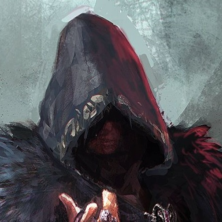

---
{"id":"3e319c40-4232-4e60-b036-4d11a1b79500","title":"Eckart","description":"The powerful Head Sorcerer of Narre commanded awe and respect throughout the realm. His mastery of the arcane arts was unparalleled, having attained the Cognoscenti Archmage title, allowing him to read and control the minds of others.","isActivePartyMember":false,"isAlive":true,"publish":true,"date_created":"Sunday, January 15th 2023, 1:28:37 pm","date_modified":"Friday, April 19th 2024, 6:00:54 pm","cssclasses":["mado-heading"],"path":"Tabletop/Campaigns/And A Thousand Years More/Characters/Enemies/Eckart.md","permalink":"/tabletop/campaigns/and-a-thousand-years-more/characters/enemies/eckart/","PassFrontmatter":true}
---

The powerful [[Tabletop/Campaigns/And A Thousand Years More/Faction/Narre/Mages of Narre\|Head Sorcerer]] of [[Tabletop/Campaigns/And A Thousand Years More/Location/Towns and Cities/Narre\|Narre]] commanded awe and respect throughout the realm. His mastery of the arcane arts was unparalleled, having attained the [[Tabletop/Campaigns/And A Thousand Years More/Faction/Narre/Mages of Narre\|Cognoscenti Archmage]] title, allowing him to read and control the minds of others. For many years, he had been the leader of Narre until a [[Tabletop/Campaigns/And A Thousand Years More/Characters/Allies/Imtrud\|revolutionary miner]] managed to stage a coup and seize power.

## Description

- [[Tabletop/Campaigns/And A Thousand Years More/Faction/Narre/Mages of Narre\|Head Sorcerer]] of [[Tabletop/Campaigns/And A Thousand Years More/Location/Towns and Cities/Narre\|Narre]].
- Cognoscenti Mage.
	- Basically Mind Reading and Control.
- Former leader of [[Tabletop/Campaigns/And A Thousand Years More/Location/Towns and Cities/Narre\|Narre]] until the [[Tabletop/Campaigns/And A Thousand Years More/Faction/Narre/Miners of Narre\|Miners]] staged a coup

## Mentions

- [[Tabletop/Campaigns/And A Thousand Years More/Sessions/Session 008\|Session 008]]: [[Tabletop/Campaigns/And A Thousand Years More/Characters/Allies/Imtrud\|Imtrud]] enters [[Tabletop/Campaigns/And A Thousand Years More/Characters/Enemies/Eckart\|Eckart]]'s [[Tabletop/Campaigns/And A Thousand Years More/Location/Towns and Cities/Narre/Wizard Tower\|office]].
- [[Tabletop/Campaigns/And A Thousand Years More/Sessions/Session 007\|Session 007]]: [[Tabletop/Campaigns/And A Thousand Years More/Characters/Party/Lux\|I]] find [[Tabletop/Campaigns/And A Thousand Years More/Inventory/Quest/Financial Records of Narre\|Narre's Financial Records]] in [[Tabletop/Campaigns/And A Thousand Years More/Characters/Enemies/Eckart\|Eckart]]'s room as well as a map detailing a !!hiding spot in the woods!!.
- [[Tabletop/Campaigns/And A Thousand Years More/Sessions/Session 007\|Session 007]]: [[Tabletop/Campaigns/And A Thousand Years More/Faction/Misc/Party\|We]] take [[Tabletop/Campaigns/And A Thousand Years More/Quests/Completed/Free Narre\|control]] of [[Tabletop/Campaigns/And A Thousand Years More/Location/Towns and Cities/Narre\|Narre]] as [[Tabletop/Campaigns/And A Thousand Years More/Characters/Enemies/Eckart\|Eckart]] makes his escape.
- [[Tabletop/Campaigns/And A Thousand Years More/Sessions/Session 007\|Session 007]]: [[Tabletop/Campaigns/And A Thousand Years More/Faction/Misc/Party\|We]] fight our way towards to [[Tabletop/Campaigns/And A Thousand Years More/Location/Towns and Cities/Narre/Wizard Tower\|Wizard Tower]] to [[Tabletop/Campaigns/And A Thousand Years More/Quests/Completed/Free Narre\|challenge]] [[Tabletop/Campaigns/And A Thousand Years More/Characters/Enemies/Eckart\|Eckart]]'s rule.
- [[Tabletop/Campaigns/And A Thousand Years More/Sessions/Session 006\|Session 006]]: [[Tabletop/Campaigns/And A Thousand Years More/Faction/Misc/Party\|We]] defeat [[Tabletop/Campaigns/And A Thousand Years More/Characters/Enemies/Eckart\|his]] minions and give chase to the [[Tabletop/Campaigns/And A Thousand Years More/Location/Towns and Cities/Narre/Wizard Tower\|Tower]].
- [[Tabletop/Campaigns/And A Thousand Years More/Sessions/Session 006\|Session 006]]: [[Tabletop/Campaigns/And A Thousand Years More/Characters/Enemies/Eckart\|Eckart]] confronts us with his minions in the [[Tabletop/Campaigns/And A Thousand Years More/Location/Towns and Cities/Narre/Narre's Keep\|Keep]].
- [[Tabletop/Campaigns/And A Thousand Years More/Sessions/Session 004\|Session 004]]: [[Tabletop/Campaigns/And A Thousand Years More/Faction/Misc/Party\|We]] learned more about the [[Tabletop/Campaigns/And A Thousand Years More/Faction/Narre/Mages of Narre\|Cognoscenti]] from [[Tabletop/Campaigns/And A Thousand Years More/Characters/Enemies/Eckart\|their leader]].
- [[Tabletop/Campaigns/And A Thousand Years More/Sessions/Session 003\|Session 003]]: "[[Tabletop/Campaigns/And A Thousand Years More/Characters/Enemies/Eckart\|I]] want [[Tabletop/Campaigns/And A Thousand Years More/Faction/Misc/Party\|you]] to [[Tabletop/Campaigns/And A Thousand Years More/Quests/Completed/Clear the Farms of Punching Onions\|clear a field of Onions]] near the [[Tabletop/Campaigns/And A Thousand Years More/Location/Towns and Cities/Narre/Narre's Farmfields\|outskirts of Narre]]. [[Tabletop/Campaigns/And A Thousand Years More/Bestiary/Plantlike/Punching Onion\|They]]…pack a punch. [[Tabletop/Campaigns/And A Thousand Years More/Characters/Enemies/Hildegart\|Hildegart]] will give you the details. Report to me when you are done." [[Tabletop/Campaigns/And A Thousand Years More/Characters/Enemies/Eckart\|Eckart]] turns around and walks upstairs.
- [[Tabletop/Campaigns/And A Thousand Years More/Sessions/Session 003\|Session 003]]: [[Tabletop/Campaigns/And A Thousand Years More/Characters/Enemies/Eckart\|He]] continues "So I want you to do [[Tabletop/Campaigns/And A Thousand Years More/Quests/Completed/Clear the Farms of Punching Onions\|something else]] for me first." He turns his gaze to [[Tabletop/Campaigns/And A Thousand Years More/Characters/Party/Damjan\|Damjan]] and [[Tabletop/Campaigns/And A Thousand Years More/Characters/Party/Norrix\|Norrix]] "And rest assured, you will be well compensated for your endeavors."
- [[Tabletop/Campaigns/And A Thousand Years More/Sessions/Session 003\|Session 003]]: [[Tabletop/Campaigns/And A Thousand Years More/Characters/Enemies/Eckart\|Master Eckart]] laughs. "All in due time my dear, all in due time." He returns to his previous, more serious demeanor. "As [[Tabletop/Campaigns/And A Thousand Years More/Faction/Misc/Party\|you]] may have noticed, we have a little [[Tabletop/Campaigns/And A Thousand Years More/Quests/Completed/Clear the Sky Moss\|Sky Moss]] related problem. I want you to solve that, but first I need to know if you're up for the task."
- [[Tabletop/Campaigns/And A Thousand Years More/Sessions/Session 003\|Session 003]]: [[Tabletop/Campaigns/And A Thousand Years More/Characters/Party/Lux\|I]] look at [[Tabletop/Campaigns/And A Thousand Years More/Characters/Enemies/Eckart\|the figure]] with surprised eyes. "How did you do that?"
- [[Tabletop/Campaigns/And A Thousand Years More/Sessions/Session 003\|Session 003]]: [[Tabletop/Campaigns/And A Thousand Years More/Characters/Enemies/Eckart\|Eckart]] interrupts [[Tabletop/Campaigns/And A Thousand Years More/Characters/Party/Lux\|me]]. "You're [[Tabletop/Campaigns/And A Thousand Years More/Faction/Misc/Hornwaldia Adventurer's Guild\|adventurers]], looking for [[Tabletop/Campaigns/And A Thousand Years More/Quests/Completed/Clear the Sky Moss\|quests]], [[Tabletop/Campaigns/And A Thousand Years More/Inventory/Misc/Red Level Guild Badge\|Red badge level]]…[[Tabletop/Campaigns/And A Thousand Years More/Inventory/Misc/Green Level Guild Badge\|mostly]]" as he gives [[Tabletop/Campaigns/And A Thousand Years More/Characters/Party/Morale\|Morale]] a look.
- [[Tabletop/Campaigns/And A Thousand Years More/Sessions/Session 003\|Session 003]]: The figure nods. "I'm [[Tabletop/Campaigns/And A Thousand Years More/Characters/Enemies/Eckart\|Master Eckart]], the [[Tabletop/Campaigns/And A Thousand Years More/Faction/Narre/Mages of Narre\|Head wizard]] of [[Tabletop/Campaigns/And A Thousand Years More/Location/Towns and Cities/Narre\|Narre]]."
- [[Tabletop/Campaigns/And A Thousand Years More/Sessions/Session 003\|Session 003]]: [[Tabletop/Campaigns/And A Thousand Years More/Characters/Party/Lux\|I]] wave. "Hi. You must be [[Tabletop/Campaigns/And A Thousand Years More/Characters/Enemies/Eckart\|Master Eckart]]."
- [[Tabletop/Campaigns/And A Thousand Years More/Sessions/Session 003\|Session 003]]: A few minutes later a [[Tabletop/Campaigns/And A Thousand Years More/Characters/Enemies/Eckart\|robed figure]] arrives from upstairs.
- [[Tabletop/Campaigns/And A Thousand Years More/Sessions/Session 003\|Session 003]]: "[[Tabletop/Campaigns/And A Thousand Years More/Characters/Enemies/Eckart\|Master Eckart]] will be here in a second."
- [[Tabletop/Campaigns/And A Thousand Years More/Sessions/Session 003\|Session 003]]: "[[Tabletop/Campaigns/And A Thousand Years More/Characters/Enemies/Eckart\|Master Ekhart]] is not available for visits. Now please leave." The [[Tabletop/Campaigns/And A Thousand Years More/Characters/Enemies/Hildegart\|gorilla]] states as she looks down upon [[Tabletop/Campaigns/And A Thousand Years More/Faction/Misc/Party\|us]].
- [[Tabletop/Campaigns/And A Thousand Years More/Sessions/Session 003\|Session 003]]: [[Tabletop/Campaigns/And A Thousand Years More/Faction/Misc/Party\|We]] met with [[Tabletop/Campaigns/And A Thousand Years More/Characters/Enemies/Eckart\|Narre's leader]] in an [[Tabletop/Campaigns/And A Thousand Years More/Location/Towns and Cities/Narre/Wizard Tower\|ominous tower]].

