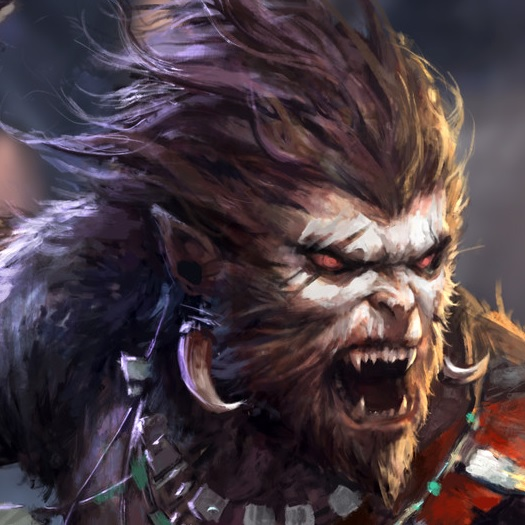

---
{"id":"3fe417da-2fc7-4b58-b509-94e522e18a8f","title":"Steven","description":"A Monkey guarding the Opeden Guild Building. Moonlights as a bandit.","isActivePartyMember":false,"isAlive":true,"publish":true,"date_created":"Sunday, January 15th 2023, 1:29:23 pm","date_modified":"Friday, April 26th 2024, 11:23:02 pm","editing_lock":false,"live_preview":true,"cssclasses":["mado-heading"],"path":"Tabletop/Campaigns/And A Thousand Years More/Characters/Enemies/Steven.md","permalink":"/tabletop/campaigns/and-a-thousand-years-more/characters/enemies/steven/","PassFrontmatter":true}
---

## Description

- Monkey guarding the [[Tabletop/Campaigns/And A Thousand Years More/Location/Towns and Cities/Opeden\|Opeden]] [[Tabletop/Campaigns/And A Thousand Years More/Location/Towns and Cities/Opeden/Opeden Guild Building\|Guild Building]].
- Secretly a Bandit.

## Mentions

- [[Tabletop/Campaigns/And A Thousand Years More/Sessions/Session 002\|Session 002]]: [[Tabletop/Campaigns/And A Thousand Years More/Faction/Misc/Party\|We]] barge inside, capturing the [[Tabletop/Campaigns/And A Thousand Years More/Faction/Opeden/Bandits of Opeden\|remaining monkeys]] including [[Tabletop/Campaigns/And A Thousand Years More/Characters/Enemies/Steven\|Steven]].
- [[Tabletop/Campaigns/And A Thousand Years More/Sessions/Session 002\|Session 002]]: As [[Tabletop/Campaigns/And A Thousand Years More/Faction/Misc/Party\|we]] move into the bushes, we can see a glimpse of [[Tabletop/Campaigns/And A Thousand Years More/Characters/Enemies/Steven\|Steven]] meeting up with a [[Tabletop/Campaigns/And A Thousand Years More/Faction/Opeden/Bandits of Opeden\|group of monkeys]]. As [[Tabletop/Campaigns/And A Thousand Years More/Characters/Enemies/Steven\|Steven]] walks into an [[Tabletop/Campaigns/And A Thousand Years More/Location/Towns and Cities/Opeden/Abandoned Windmill\|old, abandoned windmill]].
- [[Tabletop/Campaigns/And A Thousand Years More/Sessions/Session 002\|Session 002]]: After about an hour, [[Tabletop/Campaigns/And A Thousand Years More/Characters/Enemies/Steven\|Steven]] suddenly dashes towards the bushes. [[Tabletop/Campaigns/And A Thousand Years More/Faction/Misc/Party\|We]] briefly wait before walking to the bushes.
- [[Tabletop/Campaigns/And A Thousand Years More/Sessions/Session 002\|Session 002]]: [[Tabletop/Campaigns/And A Thousand Years More/Faction/Misc/Party\|We]] back off and follow [[Tabletop/Campaigns/And A Thousand Years More/Characters/Enemies/Steven\|Steven]] from a larger distance.
- [[Tabletop/Campaigns/And A Thousand Years More/Sessions/Session 002\|Session 002]]: [[Tabletop/Campaigns/And A Thousand Years More/Characters/Enemies/Steven\|Steven]] shakes his head. "I have not. Anything else?"
- [[Tabletop/Campaigns/And A Thousand Years More/Sessions/Session 002\|Session 002]]: [[Tabletop/Campaigns/And A Thousand Years More/Characters/Party/Lux\|I]] quickly dash towards [[Tabletop/Campaigns/And A Thousand Years More/Characters/Enemies/Steven\|Steven]]. "Hey Steven" I muster as innocently as I can. "I heard the [[Tabletop/Campaigns/And A Thousand Years More/Faction/Opeden/Bandits of Opeden\|bandits]] near [[Tabletop/Campaigns/And A Thousand Years More/Location/Towns and Cities/Narre\|Narre]] were all supposedly monkeys. Have you heard anything about it?"
- [[Tabletop/Campaigns/And A Thousand Years More/Sessions/Session 002\|Session 002]]: [[Tabletop/Campaigns/And A Thousand Years More/Faction/Misc/Party\|We]] follow [[Tabletop/Campaigns/And A Thousand Years More/Characters/Enemies/Steven\|Steven]] to the outskirts of [[Tabletop/Campaigns/And A Thousand Years More/Location/Towns and Cities/Opeden\|Opeden]]. Suddenly, he turns around and looks at us.
- [[Tabletop/Campaigns/And A Thousand Years More/Sessions/Session 002\|Session 002]]: [[Tabletop/Campaigns/And A Thousand Years More/Faction/Misc/Party\|We]] quickly agree to tail [[Tabletop/Campaigns/And A Thousand Years More/Characters/Enemies/Steven\|him]].
- [[Tabletop/Campaigns/And A Thousand Years More/Sessions/Session 002\|Session 002]]: Suddenly [[Tabletop/Campaigns/And A Thousand Years More/Characters/Party/Morale\|Morale]] barges in. "Guys, [[Tabletop/Campaigns/And A Thousand Years More/Characters/Enemies/Steven\|Steven]] is sneaking out of town towards the [[Tabletop/Campaigns/And A Thousand Years More/Location/Towns and Cities/Opeden/Opeden Forest\|woods]]."
- [[Tabletop/Campaigns/And A Thousand Years More/Sessions/Session 001\|Session 001]]: As [[Tabletop/Campaigns/And A Thousand Years More/Faction/Misc/Party\|we]] approach the [[Tabletop/Campaigns/And A Thousand Years More/Location/Towns and Cities/Opeden/Opeden Guild Building\|guild building]] entrance, we are stopped by two guards: A [[Tabletop/Campaigns/And A Thousand Years More/Characters/Neutral/Peter\|gorilla]] and a [[Tabletop/Campaigns/And A Thousand Years More/Characters/Enemies/Steven\|monkey]].

