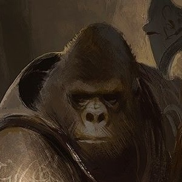

---
{"id":"73e43eca-8a33-43e2-844d-4f16a52c1382","title":"Peter","description":"A Gorilla guarding Opeden's Guild Building.","isActivePartyMember":false,"isAlive":true,"publish":true,"date_created":"Sunday, January 15th 2023, 1:29:16 pm","date_modified":"Friday, April 26th 2024, 11:23:02 pm","editing_lock":false,"live_preview":true,"cssclasses":["mado-heading"],"PassFrontmatter":true}
---

## Description

- Gorilla guarding the Guild Building in [[Tabletop/Campaigns/And A Thousand Years More/Location/Towns and Cities/Opeden\|Opeden]].

## Mentions

- [[Tabletop/Campaigns/And A Thousand Years More/Sessions/Session 001\|Session 001]]: [[Tabletop/Campaigns/And A Thousand Years More/Faction/Misc/Party\|We]] show our [[Tabletop/Campaigns/And A Thousand Years More/Inventory/Misc/Green Level Guild Badge\|Green Level Guild Badge]] to the [[Tabletop/Campaigns/And A Thousand Years More/Characters/Neutral/Peter\|gorilla]]. He denies us entrance to the [[Tabletop/Campaigns/And A Thousand Years More/Location/Towns and Cities/Opeden/Opeden Guild Building\|building]].
- [[Tabletop/Campaigns/And A Thousand Years More/Sessions/Session 001\|Session 001]]: The [[Tabletop/Campaigns/And A Thousand Years More/Characters/Neutral/Peter\|gorilla]] wants to see our [[Tabletop/Campaigns/And A Thousand Years More/Inventory/Misc/Green Level Guild Badge\|badges]] before he allows entrance.
- [[Tabletop/Campaigns/And A Thousand Years More/Sessions/Session 001\|Session 001]]: As [[Tabletop/Campaigns/And A Thousand Years More/Faction/Misc/Party\|we]] approach the [[Tabletop/Campaigns/And A Thousand Years More/Location/Towns and Cities/Opeden/Opeden Guild Building\|guild building]] entrance, we are stopped by two guards: A [[Tabletop/Campaigns/And A Thousand Years More/Characters/Neutral/Peter\|gorilla]] and a [[Tabletop/Campaigns/And A Thousand Years More/Characters/Enemies/Steven\|monkey]].

