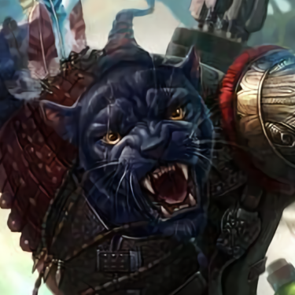

---
{"id":"28c30c64-663d-4e68-aa19-d35212aa7ab7","title":"Damjan","description":"Damjan Gjergj Meridius.","isActivePartyMember":true,"isAlive":true,"publish":true,"date_created":"Saturday, January 14th 2023, 10:33:04 am","date_modified":"Friday, April 19th 2024, 6:07:49 pm","cssclasses":["mado-heading"],"path":"Tabletop/Campaigns/And A Thousand Years More/Characters/Party/Damjan.md","permalink":"/tabletop/campaigns/and-a-thousand-years-more/characters/party/damjan/","PassFrontmatter":true}
---

## Description

- Full name: Damjan Gjergj Meridius
- Motto: "La vengeance se mange très bien froide."
- Deserted (Soldier) Panther
- Great with ranged combat
- Secretly wants to overthrow the Empire

## Mentions

- [[Tabletop/Campaigns/And A Thousand Years More/Sessions/Session 011\|Session 011]]: [[Tabletop/Campaigns/And A Thousand Years More/Characters/Party/Lux\|I]] notice that the ground absorbs all the blood from [[Tabletop/Campaigns/And A Thousand Years More/Characters/Party/Damjan\|Damjan]].
- [[Tabletop/Campaigns/And A Thousand Years More/Sessions/Session 011\|Session 011]]: [[Tabletop/Campaigns/And A Thousand Years More/Characters/Party/Norrix\|Norrix]] strikes down [[Tabletop/Campaigns/And A Thousand Years More/Characters/Party/Damjan\|Damjan]], winning the match.
- [[Tabletop/Campaigns/And A Thousand Years More/Sessions/Session 011\|Session 011]]: [[Tabletop/Campaigns/And A Thousand Years More/Characters/Party/Damjan\|Damjan]] draws his Main Guache.
- [[Tabletop/Campaigns/And A Thousand Years More/Sessions/Session 011\|Session 011]]: [[Tabletop/Campaigns/And A Thousand Years More/Characters/Party/Norrix\|Norrix]] walks up to [[Tabletop/Campaigns/And A Thousand Years More/Characters/Party/Damjan\|Damjan]], bracing his trusty Mace.
- [[Tabletop/Campaigns/And A Thousand Years More/Sessions/Session 011\|Session 011]]: [[Tabletop/Campaigns/And A Thousand Years More/Characters/Party/Damjan\|Damjan]] dashes away, grabbing his sword and stepping in a spike trap.
- [[Tabletop/Campaigns/And A Thousand Years More/Sessions/Session 011\|Session 011]]: [[Tabletop/Campaigns/And A Thousand Years More/Characters/Party/Norrix\|Norrix]] dashes and strikes with his claws, as [[Tabletop/Campaigns/And A Thousand Years More/Characters/Party/Damjan\|Damjan]] barely dodges it.
- [[Tabletop/Campaigns/And A Thousand Years More/Sessions/Session 011\|Session 011]]: [[Tabletop/Campaigns/And A Thousand Years More/Characters/Party/Damjan\|Damjan]] recovers and grabs his musket. He shoots, barely missing [[Tabletop/Campaigns/And A Thousand Years More/Characters/Party/Norrix\|Norrix]]\.
- [[Tabletop/Campaigns/And A Thousand Years More/Sessions/Session 011\|Session 011]]: [[Tabletop/Campaigns/And A Thousand Years More/Characters/Party/Norrix\|Norrix]] dashes forwards, shouting "Catch" as he throws a knife, striking [[Tabletop/Campaigns/And A Thousand Years More/Characters/Party/Damjan\|Damjan]].
- [[Tabletop/Campaigns/And A Thousand Years More/Sessions/Session 011\|Session 011]]: [[Tabletop/Campaigns/And A Thousand Years More/Characters/Party/Damjan\|Damjan]] notches an arrow and shoots, barely missing [[Tabletop/Campaigns/And A Thousand Years More/Characters/Party/Norrix\|Norrix]].
- [[Tabletop/Campaigns/And A Thousand Years More/Sessions/Session 011\|Session 011]]: [[Tabletop/Campaigns/And A Thousand Years More/Characters/Party/Damjan\|Damjan]] aims and shoots the Flame Arrow at [[Tabletop/Campaigns/And A Thousand Years More/Characters/Party/Norrix\|Norrix]] portable wall, hitting it blowing up his wall in the blast. [[Tabletop/Campaigns/And A Thousand Years More/Characters/Party/Norrix\|Norrix]] barely dodges the blast.
- [[Tabletop/Campaigns/And A Thousand Years More/Sessions/Session 011\|Session 011]]: [[Tabletop/Campaigns/And A Thousand Years More/Characters/Party/Norrix\|Norrix]] attempts to lift the portable wall, failing spectacularly. He then tries to taunt [[Tabletop/Campaigns/And A Thousand Years More/Characters/Party/Damjan\|Damjan]], once again, failing spectacularly.
- [[Tabletop/Campaigns/And A Thousand Years More/Sessions/Session 011\|Session 011]]: [[Tabletop/Campaigns/And A Thousand Years More/Characters/Party/Damjan\|Damjan]] walks forward as he readies a Flame Arrow, showing it to the crowd.
- [[Tabletop/Campaigns/And A Thousand Years More/Sessions/Session 011\|Session 011]]: [[Tabletop/Campaigns/And A Thousand Years More/Characters/Party/Damjan\|Damjan]] dashes forward and fires his first show with flair, barely missing [[Tabletop/Campaigns/And A Thousand Years More/Characters/Party/Norrix\|Norrix]].
- [[Tabletop/Campaigns/And A Thousand Years More/Sessions/Session 011\|Session 011]]: [[Tabletop/Campaigns/And A Thousand Years More/Characters/Party/Damjan\|Damjan]] is the crowd favorite. Both can use the crowds favor to influences the battle.
- [[Tabletop/Campaigns/And A Thousand Years More/Sessions/Session 011\|Session 011]]: On [[Tabletop/Campaigns/And A Thousand Years More/Characters/Party/Damjan\|Damjan]] side is a red, smooth gemstone.
- [[Tabletop/Campaigns/And A Thousand Years More/Sessions/Session 011\|Session 011]]: Both [[Tabletop/Campaigns/And A Thousand Years More/Characters/Party/Norrix\|Norrix]] and [[Tabletop/Campaigns/And A Thousand Years More/Characters/Party/Damjan\|Damjan]] enter the arena, both noticing several traps on their own side.
- [[Tabletop/Campaigns/And A Thousand Years More/Sessions/Session 011\|Session 011]]: He introcudes [[Tabletop/Campaigns/And A Thousand Years More/Characters/Party/Norrix\|Norrix]] and [[Tabletop/Campaigns/And A Thousand Years More/Characters/Party/Damjan\|Damjan]] as the contestants.
- [[Tabletop/Campaigns/And A Thousand Years More/Sessions/Session 011\|Session 011]]: [[Tabletop/Campaigns/And A Thousand Years More/Characters/Party/Damjan\|Damjan]] walks around the city in his Apothecary Gawn. Everyone is hyped to see him fight [[Tabletop/Campaigns/And A Thousand Years More/Characters/Party/Norrix\|Norrix]].
- [[Tabletop/Campaigns/And A Thousand Years More/Sessions/Session 009\|Session 009]]: [[Tabletop/Campaigns/And A Thousand Years More/Characters/Party/Lux\|I]] and [[Tabletop/Campaigns/And A Thousand Years More/Characters/Party/Damjan\|Damjan]] stay in the Tavern. [[Tabletop/Campaigns/And A Thousand Years More/Characters/Party/Norrix\|Norrix]] tails the [[Tabletop/Campaigns/And A Thousand Years More/Characters/Enemies/Anton\|gorilla]].
- [[Tabletop/Campaigns/And A Thousand Years More/Sessions/Session 009\|Session 009]]: [[Tabletop/Campaigns/And A Thousand Years More/Characters/Neutral/Sir Andre\|Sir Andre]] explains [[Tabletop/Campaigns/And A Thousand Years More/Characters/Party/Damjan\|Damjan]] the rules of the [[Tabletop/Campaigns/And A Thousand Years More/Location/Towns and Cities/Wildt/Wildt's Fair\|fair]]. It's a deathmatch.
- [[Tabletop/Campaigns/And A Thousand Years More/Sessions/Session 009\|Session 009]]: A guard walks [[Tabletop/Campaigns/And A Thousand Years More/Characters/Party/Damjan\|Damjan]] to [[Tabletop/Campaigns/And A Thousand Years More/Characters/Neutral/Sir Andre\|Sir Andre]]. [[Tabletop/Campaigns/And A Thousand Years More/Characters/Neutral/Sir Andre\|He]] offers [[Tabletop/Campaigns/And A Thousand Years More/Characters/Party/Damjan\|Damjan]] a new uniform to fight in to hide his identity. [[Tabletop/Campaigns/And A Thousand Years More/Characters/Party/Damjan\|He]] agrees.
- [[Tabletop/Campaigns/And A Thousand Years More/Sessions/Session 009\|Session 009]]: After a while, [[Tabletop/Campaigns/And A Thousand Years More/Characters/Neutral/Sir Andre\|Sir Andre]] enters the room and announces the [[Tabletop/Campaigns/And A Thousand Years More/Faction/Wildt/Wildt Apothecary Guild\|guild champion]]. It's [[Tabletop/Campaigns/And A Thousand Years More/Characters/Party/Damjan\|Damjan]].
- [[Tabletop/Campaigns/And A Thousand Years More/Sessions/Session 009\|Session 009]]: [[Tabletop/Campaigns/And A Thousand Years More/Characters/Neutral/Sir Andre\|Sir Andre]] offers [[Tabletop/Campaigns/And A Thousand Years More/Characters/Party/Damjan\|him]] redemption in the [[Tabletop/Campaigns/And A Thousand Years More/Location/Towns and Cities/Wildt/Wildt's Fair\|Ring]].
- [[Tabletop/Campaigns/And A Thousand Years More/Sessions/Session 009\|Session 009]]: [[Tabletop/Campaigns/And A Thousand Years More/Characters/Neutral/Sir Andre\|Sir Andre]] recognizes [[Tabletop/Campaigns/And A Thousand Years More/Characters/Party/Damjan\|his]] company and past war crimes.
- [[Tabletop/Campaigns/And A Thousand Years More/Sessions/Session 009\|Session 009]]: [[Tabletop/Campaigns/And A Thousand Years More/Characters/Party/Damjan\|Damjan]] meets with a scrawny donkey, named [[Tabletop/Campaigns/And A Thousand Years More/Characters/Neutral/Sir Andre\|Sir Andre]]. [[Tabletop/Campaigns/And A Thousand Years More/Characters/Party/Damjan\|He]] explains his story.
- [[Tabletop/Campaigns/And A Thousand Years More/Sessions/Session 009\|Session 009]]: [[Tabletop/Campaigns/And A Thousand Years More/Characters/Party/Damjan\|Damjan]] has a meeting with Lemoine at the [[Tabletop/Campaigns/And A Thousand Years More/Faction/Wildt/Wildt Apothecary Guild\|guild building]].
- [[Tabletop/Campaigns/And A Thousand Years More/Sessions/Session 009\|Session 009]]: [[Tabletop/Campaigns/And A Thousand Years More/Characters/Party/Damjan\|Damjan]] decides to join the [[Tabletop/Campaigns/And A Thousand Years More/Faction/Wildt/Wildt Apothecary Guild\|other party]] to participate. [[Tabletop/Campaigns/And A Thousand Years More/Faction/Wildt/Wildt Apothecary Guild\|They]] want [[Tabletop/Campaigns/And A Thousand Years More/Characters/Party/Damjan\|him]] to speak with a [[Tabletop/Campaigns/And A Thousand Years More/Characters/Neutral/Sir Andre\|higher-up]] in the [[Tabletop/Campaigns/And A Thousand Years More/Location/Towns and Cities/Wildt/Wildt's Apothecary Guild Building\|guild]].
- [[Tabletop/Campaigns/And A Thousand Years More/Sessions/Session 009\|Session 009]]: [[Tabletop/Campaigns/And A Thousand Years More/Characters/Party/Damjan\|Damjan]] and [[Tabletop/Campaigns/And A Thousand Years More/Characters/Party/Norrix\|Norrix]] both decide to participate in the in the second round.
- [[Tabletop/Campaigns/And A Thousand Years More/Sessions/Session 009\|Session 009]]: [[Tabletop/Campaigns/And A Thousand Years More/Characters/Party/Damjan\|Damjan]] wants look for favor in a temple. There is a small temple of [[Tabletop/Campaigns/And A Thousand Years More/Faction/Misc/Church of S'Allamer\|S'Allamer]].
- [[Tabletop/Campaigns/And A Thousand Years More/Sessions/Session 009\|Session 009]]: [[Tabletop/Campaigns/And A Thousand Years More/Characters/Party/Damjan\|Damjan]] wants to learn to read.
- [[Tabletop/Campaigns/And A Thousand Years More/Sessions/Session 009\|Session 009]]: [[Tabletop/Campaigns/And A Thousand Years More/Characters/Party/Damjan\|Damjan]] introduces himself by showing his [[Tabletop/Campaigns/And A Thousand Years More/Inventory/Misc/Red Level Guild Badge\|Red Level Guild Badge]].
- [[Tabletop/Campaigns/And A Thousand Years More/Sessions/Session 009\|Session 009]]: [[Tabletop/Campaigns/And A Thousand Years More/Characters/Party/Damjan\|Damjan]] is accepted as the [[Tabletop/Campaigns/And A Thousand Years More/Faction/Wildt/Wildt Apothecary Guild\|Apothecary]] Champion after meeting a [[Tabletop/Campaigns/And A Thousand Years More/Characters/Neutral/Sir Andre\|familiar face]].
- [[Tabletop/Campaigns/And A Thousand Years More/Sessions/Session 009\|Session 009]]: [[Tabletop/Campaigns/And A Thousand Years More/Characters/Party/Norrix\|Norrix]] and [[Tabletop/Campaigns/And A Thousand Years More/Characters/Party/Damjan\|Damjan]] decide to participate in the [[Tabletop/Campaigns/And A Thousand Years More/Location/Towns and Cities/Wildt/Wildt's Fair\|event]].
- [[Tabletop/Campaigns/And A Thousand Years More/Sessions/Session 003\|Session 003]]: [[Tabletop/Campaigns/And A Thousand Years More/Characters/Party/Lux\|I]] watch as [[Tabletop/Campaigns/And A Thousand Years More/Characters/Party/Norrix\|Norrix]] and [[Tabletop/Campaigns/And A Thousand Years More/Characters/Party/Damjan\|Damjan]] make quick work of the [[Tabletop/Campaigns/And A Thousand Years More/Bestiary/Plantlike/Punching Onion\|Onions]].
- [[Tabletop/Campaigns/And A Thousand Years More/Sessions/Session 003\|Session 003]]: [[Tabletop/Campaigns/And A Thousand Years More/Characters/Enemies/Eckart\|He]] continues "So I want you to do [[Tabletop/Campaigns/And A Thousand Years More/Quests/Completed/Clear the Farms of Punching Onions\|something else]] for me first." He turns his gaze to [[Tabletop/Campaigns/And A Thousand Years More/Characters/Party/Damjan\|Damjan]] and [[Tabletop/Campaigns/And A Thousand Years More/Characters/Party/Norrix\|Norrix]] "And rest assured, you will be well compensated for your endeavors."
- [[Tabletop/Campaigns/And A Thousand Years More/Sessions/Session 003\|Session 003]]: "For a price." [[Tabletop/Campaigns/And A Thousand Years More/Characters/Party/Damjan\|Damjan]] remarks.
- [[Tabletop/Campaigns/And A Thousand Years More/Sessions/Session 002\|Session 002]]: [[Tabletop/Campaigns/And A Thousand Years More/Characters/Party/Morale\|Morale]] flies up and dives towards the [[Tabletop/Campaigns/And A Thousand Years More/Faction/Opeden/Bandits of Opeden\|bandit in the back]]. [[Tabletop/Campaigns/And A Thousand Years More/Characters/Party/Norrix\|Norrix]] charges in as [[Tabletop/Campaigns/And A Thousand Years More/Characters/Party/Damjan\|Damjan]] notches an arrow.
- [[Tabletop/Campaigns/And A Thousand Years More/Sessions/Session 002\|Session 002]]: [[Tabletop/Campaigns/And A Thousand Years More/Characters/Party/Norrix\|Norrix]] walks back to the bar as [[Tabletop/Campaigns/And A Thousand Years More/Characters/Party/Damjan\|Damjan]] ponders. "A free ride and a [[Tabletop/Campaigns/And A Thousand Years More/Characters/Allies/Leon\|potential ally]]. Hmm." [[Tabletop/Campaigns/And A Thousand Years More/Characters/Party/Damjan\|Damjan]] thinks out loud. "Alright. [[Tabletop/Campaigns/And A Thousand Years More/Faction/Misc/Party\|We]]'ll see what we can do."
- [[Tabletop/Campaigns/And A Thousand Years More/Sessions/Session 002\|Session 002]]: [[Tabletop/Campaigns/And A Thousand Years More/Characters/Party/Lux\|I]] pull [[Tabletop/Campaigns/And A Thousand Years More/Characters/Party/Damjan\|Damjan]] and [[Tabletop/Campaigns/And A Thousand Years More/Characters/Party/Norrix\|Norrix]] from the bar. "[[Tabletop/Campaigns/And A Thousand Years More/Quests/Completed/Defeat the Bandits\|I found a quest]]."
- [[Tabletop/Campaigns/And A Thousand Years More/Sessions/Session 001\|Session 001]]: [[Tabletop/Campaigns/And A Thousand Years More/Characters/Party/Lux\|I]] look back to the ring to see how the others are doing. [[Tabletop/Campaigns/And A Thousand Years More/Characters/Party/Norrix\|Norrix]] seems to have defeated the gorilla spectacularly. Meanwhile [[Tabletop/Campaigns/And A Thousand Years More/Characters/Party/Damjan\|Damjan]] is counting his returns on the bet.
- [[Tabletop/Campaigns/And A Thousand Years More/Sessions/Session 001\|Session 001]]: [[Tabletop/Campaigns/And A Thousand Years More/Characters/Party/Damjan\|Damjan]] looks at [[Tabletop/Campaigns/And A Thousand Years More/Characters/Party/Norrix\|Norrix]] and nods, and [[Tabletop/Campaigns/And A Thousand Years More/Characters/Party/Norrix\|Norrix]] nods back. Shortly after [[Tabletop/Campaigns/And A Thousand Years More/Characters/Party/Norrix\|Norrix]] enters the ring as [[Tabletop/Campaigns/And A Thousand Years More/Characters/Party/Damjan\|Damjan]] bets money on his victory.

