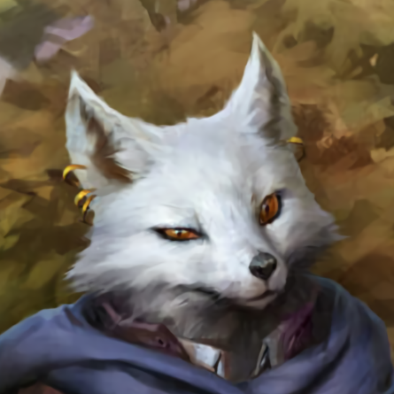

---
{"id":"6ec1ca1d-07a7-4740-b463-564da624a02e","title":"Lux","description":"Luvia Lux Scientia.","isActivePartyMember":true,"isAlive":true,"publish":true,"date_created":"Friday, January 13th 2023, 8:44:17 am","date_modified":"Friday, April 26th 2024, 11:23:02 pm","editing_lock":false,"live_preview":true,"cssclasses":["mado-heading"],"PassFrontmatter":true}
---

## Description

- Full name: Livia 'Lux' Scientia
- Motto: "The only wrong question is one that isn't asked"
- Young Gray Fox
- Fled home because her parents were betrayed by the Empire
	- Has a letter exposing the person responsible

## Mentions

- [[Tabletop/Campaigns/And A Thousand Years More/Sessions/Session 011\|Session 011]]: [[Tabletop/Campaigns/And A Thousand Years More/Characters/Party/Lux\|I]] notice that the ground absorbs all the blood from [[Tabletop/Campaigns/And A Thousand Years More/Characters/Party/Damjan\|Damjan]].
- [[Tabletop/Campaigns/And A Thousand Years More/Sessions/Session 009\|Session 009]]: [[Tabletop/Campaigns/And A Thousand Years More/Characters/Party/Lux\|I]] and [[Tabletop/Campaigns/And A Thousand Years More/Characters/Party/Damjan\|Damjan]] stay in the Tavern. [[Tabletop/Campaigns/And A Thousand Years More/Characters/Party/Norrix\|Norrix]] tails the [[Tabletop/Campaigns/And A Thousand Years More/Characters/Enemies/Anton\|gorilla]].
- [[Tabletop/Campaigns/And A Thousand Years More/Sessions/Session 009\|Session 009]]: [[Tabletop/Campaigns/And A Thousand Years More/Characters/Party/Lux\|I]] make sure to get the [[Tabletop/Campaigns/And A Thousand Years More/Characters/Enemies/Anton\|gorilla]] drunk in order to be able to make my escape.
- [[Tabletop/Campaigns/And A Thousand Years More/Sessions/Session 009\|Session 009]]: The [[Tabletop/Campaigns/And A Thousand Years More/Characters/Enemies/Anton\|Gorilla]] and [[Tabletop/Campaigns/And A Thousand Years More/Characters/Party/Lux\|I]] go for a drink. Wine's on him.
- [[Tabletop/Campaigns/And A Thousand Years More/Sessions/Session 009\|Session 009]]: [[Tabletop/Campaigns/And A Thousand Years More/Characters/Party/Lux\|I]] interview the unnamed gorilla. He keeps talking for four hours. [[Tabletop/Campaigns/And A Thousand Years More/Characters/Party/Lux\|I]] write everything down.
- [[Tabletop/Campaigns/And A Thousand Years More/Sessions/Session 009\|Session 009]]: [[Tabletop/Campaigns/And A Thousand Years More/Characters/Party/Norrix\|Norrix]] explains what happened to [[Tabletop/Campaigns/And A Thousand Years More/Characters/Party/Lux\|me]].
- [[Tabletop/Campaigns/And A Thousand Years More/Sessions/Session 009\|Session 009]]: [[Tabletop/Campaigns/And A Thousand Years More/Characters/Party/Norrix\|Norrix]] and [[Tabletop/Campaigns/And A Thousand Years More/Characters/Party/Lux\|I]] walks up to the [[Tabletop/Campaigns/And A Thousand Years More/Location/Towns and Cities/Wildt/Wildt's Armory\|armorer]], looking to sell some excess equipment. [[Tabletop/Campaigns/And A Thousand Years More/Characters/Party/Norrix\|Norrix]] throws all of his excess equipment on the counter.
- [[Tabletop/Campaigns/And A Thousand Years More/Sessions/Session 009\|Session 009]]: [[Tabletop/Campaigns/And A Thousand Years More/Characters/Party/Lux\|I]] suggest contacting the two main parties to look for equipment and lodging.
- [[Tabletop/Campaigns/And A Thousand Years More/Sessions/Session 009\|Session 009]]: [[Tabletop/Campaigns/And A Thousand Years More/Characters/Party/Lux\|I]] ask one of the townsfolk for information of [[Tabletop/Campaigns/And A Thousand Years More/Location/Towns and Cities/Wildt/Wildt's Fair\|the competition]]. He explains there will be two rounds in the [[Tabletop/Campaigns/And A Thousand Years More/Location/Towns and Cities/Wildt/Wildt's Town Center\|town center]]. The first round will be for points and the second round will be one-on-one fights. Both of the two main parties, the [[Tabletop/Campaigns/And A Thousand Years More/Faction/Wildt/Wildt Apothecary Guild\|Apothecaries]] and the [[Tabletop/Campaigns/And A Thousand Years More/Faction/Wildt/Wildt Mercenary Guild\|Mercenaries]], are still looking for a champions.
- [[Tabletop/Campaigns/And A Thousand Years More/Sessions/Session 009\|Session 009]]: [[Tabletop/Campaigns/And A Thousand Years More/Characters/Party/Lux\|I]] introduce myself as a [[Tabletop/Campaigns/And A Thousand Years More/Inventory/Misc/Writing Kit\|writer]] looking for stories.
- [[Tabletop/Campaigns/And A Thousand Years More/Sessions/Session 007\|Session 007]]: [[Tabletop/Campaigns/And A Thousand Years More/Characters/Party/Lux\|I]] find [[Tabletop/Campaigns/And A Thousand Years More/Inventory/Quest/Financial Records of Narre\|Narre's Financial Records]] in [[Tabletop/Campaigns/And A Thousand Years More/Characters/Enemies/Eckart\|Eckart]]'s room as well as a map detailing a !!hiding spot in the woods!!.
- [[Tabletop/Campaigns/And A Thousand Years More/Sessions/Session 005\|Session 005]]: [[Tabletop/Campaigns/And A Thousand Years More/Characters/Party/Lux\|I]] made some [[Tabletop/Campaigns/And A Thousand Years More/Inventory/Consumable/Grandma's Cookies\|Cookies]] and gave them to the [[Tabletop/Campaigns/And A Thousand Years More/Faction/Narre/Keep Guards of Narre\|guards]].
- [[Tabletop/Campaigns/And A Thousand Years More/Sessions/Session 003\|Session 003]]: [[Tabletop/Campaigns/And A Thousand Years More/Characters/Party/Lux\|I]] watch as [[Tabletop/Campaigns/And A Thousand Years More/Characters/Party/Norrix\|Norrix]] and [[Tabletop/Campaigns/And A Thousand Years More/Characters/Party/Damjan\|Damjan]] make quick work of the [[Tabletop/Campaigns/And A Thousand Years More/Bestiary/Plantlike/Punching Onion\|Onions]].
- [[Tabletop/Campaigns/And A Thousand Years More/Sessions/Session 003\|Session 003]]: [[Tabletop/Campaigns/And A Thousand Years More/Characters/Party/Lux\|I]] nod. "[[Tabletop/Campaigns/And A Thousand Years More/Faction/Misc/Party\|They]] got this."
- [[Tabletop/Campaigns/And A Thousand Years More/Sessions/Session 003\|Session 003]]: [[Tabletop/Campaigns/And A Thousand Years More/Characters/Party/Lux\|I]] look at [[Tabletop/Campaigns/And A Thousand Years More/Characters/Enemies/Eckart\|the figure]] with surprised eyes. "How did you do that?"
- [[Tabletop/Campaigns/And A Thousand Years More/Sessions/Session 003\|Session 003]]: [[Tabletop/Campaigns/And A Thousand Years More/Characters/Enemies/Eckart\|Eckart]] interrupts [[Tabletop/Campaigns/And A Thousand Years More/Characters/Party/Lux\|me]]. "You're [[Tabletop/Campaigns/And A Thousand Years More/Faction/Misc/Hornwaldia Adventurer's Guild\|adventurers]], looking for [[Tabletop/Campaigns/And A Thousand Years More/Quests/Completed/Clear the Sky Moss\|quests]], [[Tabletop/Campaigns/And A Thousand Years More/Inventory/Misc/Red Level Guild Badge\|Red badge level]]…[[Tabletop/Campaigns/And A Thousand Years More/Inventory/Misc/Green Level Guild Badge\|mostly]]" as he gives [[Tabletop/Campaigns/And A Thousand Years More/Characters/Party/Morale\|Morale]] a look.
- [[Tabletop/Campaigns/And A Thousand Years More/Sessions/Session 003\|Session 003]]: [[Tabletop/Campaigns/And A Thousand Years More/Characters/Party/Lux\|I]] wave. "Hi. You must be [[Tabletop/Campaigns/And A Thousand Years More/Characters/Enemies/Eckart\|Master Eckart]]."
- [[Tabletop/Campaigns/And A Thousand Years More/Sessions/Session 003\|Session 003]]: "Yes…" [[Tabletop/Campaigns/And A Thousand Years More/Characters/Party/Lux\|I]] mumble as I show my [[Tabletop/Campaigns/And A Thousand Years More/Inventory/Misc/Red Level Guild Badge\|Red badge]].
- [[Tabletop/Campaigns/And A Thousand Years More/Sessions/Session 003\|Session 003]]: [[Tabletop/Campaigns/And A Thousand Years More/Characters/Allies/Leon\|Leon]] grins "It's a [[Tabletop/Campaigns/And A Thousand Years More/Location/Towns and Cities/Narre/Narre's Keep\|prison]] my [[Tabletop/Campaigns/And A Thousand Years More/Characters/Party/Lux\|dear]], try not to get stuck there."
- [[Tabletop/Campaigns/And A Thousand Years More/Sessions/Session 003\|Session 003]]: "Maybe [[Tabletop/Campaigns/And A Thousand Years More/Faction/Misc/Party\|we]] can help them clear it!" [[Tabletop/Campaigns/And A Thousand Years More/Characters/Party/Lux\|I]] say with a smile.
- [[Tabletop/Campaigns/And A Thousand Years More/Sessions/Session 003\|Session 003]]: [[Tabletop/Campaigns/And A Thousand Years More/Characters/Party/Lux\|I]] point towards [[Tabletop/Campaigns/And A Thousand Years More/Characters/Party/Morale\|Morale]]. "This one, he has come to apologize fo-"
- [[Tabletop/Campaigns/And A Thousand Years More/Sessions/Session 003\|Session 003]]: "[[Tabletop/Campaigns/And A Thousand Years More/Faction/Misc/Party\|We]] have come to return something" [[Tabletop/Campaigns/And A Thousand Years More/Characters/Party/Lux\|I]] say as I put down the Blue level quest [[Tabletop/Campaigns/And A Thousand Years More/Characters/Party/Morale\|Morale]] took earlier.
- [[Tabletop/Campaigns/And A Thousand Years More/Sessions/Session 002\|Session 002]]: [[Tabletop/Campaigns/And A Thousand Years More/Characters/Party/Lux\|I]] shake my head, trying my best to convincingly look disappointed.
- [[Tabletop/Campaigns/And A Thousand Years More/Sessions/Session 002\|Session 002]]: [[Tabletop/Campaigns/And A Thousand Years More/Characters/Party/Lux\|I]] quickly dash towards [[Tabletop/Campaigns/And A Thousand Years More/Characters/Enemies/Steven\|Steven]]. "Hey Steven" I muster as innocently as I can. "I heard the [[Tabletop/Campaigns/And A Thousand Years More/Faction/Opeden/Bandits of Opeden\|bandits]] near [[Tabletop/Campaigns/And A Thousand Years More/Location/Towns and Cities/Narre\|Narre]] were all supposedly monkeys. Have you heard anything about it?"
- [[Tabletop/Campaigns/And A Thousand Years More/Sessions/Session 002\|Session 002]]: [[Tabletop/Campaigns/And A Thousand Years More/Characters/Party/Lux\|I]] pull [[Tabletop/Campaigns/And A Thousand Years More/Characters/Party/Damjan\|Damjan]] and [[Tabletop/Campaigns/And A Thousand Years More/Characters/Party/Norrix\|Norrix]] from the bar. "[[Tabletop/Campaigns/And A Thousand Years More/Quests/Completed/Defeat the Bandits\|I found a quest]]."
- [[Tabletop/Campaigns/And A Thousand Years More/Sessions/Session 002\|Session 002]]: [[Tabletop/Campaigns/And A Thousand Years More/Characters/Party/Lux\|I]] walk up to [[Tabletop/Campaigns/And A Thousand Years More/Characters/Allies/Leon\|the figure]]. "Hi, I'm [[Tabletop/Campaigns/And A Thousand Years More/Characters/Party/Lux\|Lux]]. How are you?"
- [[Tabletop/Campaigns/And A Thousand Years More/Sessions/Session 001\|Session 001]]: [[Tabletop/Campaigns/And A Thousand Years More/Characters/Party/Lux\|I]] look back to the ring to see how the others are doing. [[Tabletop/Campaigns/And A Thousand Years More/Characters/Party/Norrix\|Norrix]] seems to have defeated the gorilla spectacularly. Meanwhile [[Tabletop/Campaigns/And A Thousand Years More/Characters/Party/Damjan\|Damjan]] is counting his returns on the bet.
- [[Tabletop/Campaigns/And A Thousand Years More/Sessions/Session 001\|Session 001]]: [[Tabletop/Campaigns/And A Thousand Years More/Characters/Party/Lux\|I]] wait until the [[Tabletop/Campaigns/And A Thousand Years More/Characters/Allies/Aleksi\|bard]] is done with his story and hand him a beer. The [[Tabletop/Campaigns/And A Thousand Years More/Characters/Allies/Aleksi\|bard]] introduces himself as [[Tabletop/Campaigns/And A Thousand Years More/Characters/Allies/Aleksi\|Aleksi]], a story collector. [[Tabletop/Campaigns/And A Thousand Years More/Characters/Allies/Aleksi\|He]] informs me about a [[Tabletop/Campaigns/And A Thousand Years More/Quests/Completed/Defeat the Bandits\|quest regarding some monkey bandits]] on the road toward [[Tabletop/Campaigns/And A Thousand Years More/Location/Towns and Cities/Narre\|Narre]].
- [[Tabletop/Campaigns/And A Thousand Years More/Sessions/Session 001\|Session 001]]: [[Tabletop/Campaigns/And A Thousand Years More/Characters/Party/Lux\|I]] order two beers and take them to the [[Tabletop/Campaigns/And A Thousand Years More/Characters/Allies/Aleksi\|bard]] while [[Tabletop/Campaigns/And A Thousand Years More/Characters/Party/Morale\|Morale]] is scribbling [[Tabletop/Campaigns/And A Thousand Years More/Inventory/Misc/Green Level Guild Badge\|something]] with his makeup.
- [[Tabletop/Campaigns/And A Thousand Years More/Sessions/Session 001\|Session 001]]: "Did you get in?" [[Tabletop/Campaigns/And A Thousand Years More/Characters/Party/Morale\|Morale]] asks. "No," [[Tabletop/Campaigns/And A Thousand Years More/Characters/Party/Lux\|I]] respond. "We need [[Tabletop/Campaigns/And A Thousand Years More/Inventory/Misc/Red Level Guild Badge\|a red badge]]."
- [[Tabletop/Campaigns/And A Thousand Years More/Sessions/Session 001\|Session 001]]: [[Tabletop/Campaigns/And A Thousand Years More/Characters/Party/Lux\|I]] see a [[Tabletop/Campaigns/And A Thousand Years More/Characters/Allies/Aleksi\|bard]] in the corner and [[Tabletop/Campaigns/And A Thousand Years More/Characters/Party/Morale\|Morale]] at the bar. I walk up to [[Tabletop/Campaigns/And A Thousand Years More/Characters/Party/Morale\|Morale]].

