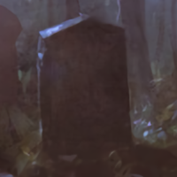

---
{"id":"7b20fd3b-bf5f-4d54-a2f7-3fc25856faa7","title":"Morale","description":"Morale Crow.","isActivePartyMember":false,"isAlive":false,"publish":true,"date_created":"Saturday, January 14th 2023, 10:34:43 am","date_modified":"Tuesday, April 16th 2024, 8:19:36 pm","cssclasses":["mado-heading"],"path":"Tabletop/Campaigns/And A Thousand Years More/Characters/Party/Morale.md","permalink":"/tabletop/campaigns/and-a-thousand-years-more/characters/party/morale/","PassFrontmatter":true}
---

## Description

- Full name: Morale Crow
- Motto: "Fool me once, shame on you, fool me twice, shame on me."
- Dives in way too fast

## Mentions

- [[Tabletop/Campaigns/And A Thousand Years More/Sessions/Session 003\|Session 003]]: [[Tabletop/Campaigns/And A Thousand Years More/Characters/Enemies/Eckart\|Eckart]] interrupts [[Tabletop/Campaigns/And A Thousand Years More/Characters/Party/Lux\|me]]. "You're [[Tabletop/Campaigns/And A Thousand Years More/Faction/Misc/Hornwaldia Adventurer's Guild\|adventurers]], looking for [[Tabletop/Campaigns/And A Thousand Years More/Quests/Completed/Clear the Sky Moss\|quests]], [[Tabletop/Campaigns/And A Thousand Years More/Inventory/Misc/Red Level Guild Badge\|Red badge level]]…[[Tabletop/Campaigns/And A Thousand Years More/Inventory/Misc/Green Level Guild Badge\|mostly]]" as he gives [[Tabletop/Campaigns/And A Thousand Years More/Characters/Party/Morale\|Morale]] a look. #Character #Faction #Quest #Item #Event
- [[Tabletop/Campaigns/And A Thousand Years More/Sessions/Session 003\|Session 003]]: The secretary interrupts me "[[Tabletop/Campaigns/And A Thousand Years More/Characters/Party/Morale\|He]] is demoted to a [[Tabletop/Campaigns/And A Thousand Years More/Inventory/Misc/Green Level Guild Badge\|Green badge]]. Anything else I can do for you?" #Character #Item #Event
- [[Tabletop/Campaigns/And A Thousand Years More/Sessions/Session 003\|Session 003]]: [[Tabletop/Campaigns/And A Thousand Years More/Characters/Party/Lux\|I]] point towards [[Tabletop/Campaigns/And A Thousand Years More/Characters/Party/Morale\|Morale]]. "This one, he has come to apologize fo-" #Character #Event
- [[Tabletop/Campaigns/And A Thousand Years More/Sessions/Session 003\|Session 003]]: The secretary gives me a glare. "Which [[Tabletop/Campaigns/And A Thousand Years More/Characters/Party/Morale\|one of your ravens]] is the one responsible for this?" #Character #Event
- [[Tabletop/Campaigns/And A Thousand Years More/Sessions/Session 003\|Session 003]]: "[[{05} Others/Templates/Resources/Tabletop/Party\|We]] have come to return something" [[Tabletop/Campaigns/And A Thousand Years More/Characters/Party/Lux\|I]] say as I put down the Blue level quest [[Tabletop/Campaigns/And A Thousand Years More/Characters/Party/Morale\|Morale]] took earlier. #Character #Faction #Event
- [[Tabletop/Campaigns/And A Thousand Years More/Sessions/Session 002\|Session 002]]: [[Tabletop/Campaigns/And A Thousand Years More/Characters/Party/Morale\|Morale]] flies up and dives towards the [[Tabletop/Campaigns/And A Thousand Years More/Faction/Opeden/Bandits of Opeden\|bandit in the back]]. [[Tabletop/Campaigns/And A Thousand Years More/Characters/Party/Norrix\|Norrix]] charges in as [[Tabletop/Campaigns/And A Thousand Years More/Characters/Party/Damjan\|Damjan]] notches an arrow. #Character #Faction #Event
- [[Tabletop/Campaigns/And A Thousand Years More/Sessions/Session 002\|Session 002]]: Suddenly [[Tabletop/Campaigns/And A Thousand Years More/Characters/Party/Morale\|Morale]] barges in. "Guys, [[Tabletop/Campaigns/And A Thousand Years More/Characters/Enemies/Steven\|Steven]] is sneaking out of town towards the [[Tabletop/Campaigns/And A Thousand Years More/Location/Towns and Cities/Opeden/Opeden Forest\|woods]]." #Character #Location #Event
- [[Tabletop/Campaigns/And A Thousand Years More/Sessions/Session 001\|Session 001]]: [[Tabletop/Campaigns/And A Thousand Years More/Characters/Party/Morale\|Morale]] confesses stealing the quest. #Character #Event
- [[Tabletop/Campaigns/And A Thousand Years More/Sessions/Session 001\|Session 001]]: [[Tabletop/Campaigns/And A Thousand Years More/Characters/Party/Lux\|I]] order two beers and take them to the [[Tabletop/Campaigns/And A Thousand Years More/Characters/Allies/Aleksi\|bard]] while [[Tabletop/Campaigns/And A Thousand Years More/Characters/Party/Morale\|Morale]] is scribbling [[Tabletop/Campaigns/And A Thousand Years More/Inventory/Misc/Green Level Guild Badge\|something]] with his makeup. #Character #Item #Event
- [[Tabletop/Campaigns/And A Thousand Years More/Sessions/Session 001\|Session 001]]: "Did you get in?" [[Tabletop/Campaigns/And A Thousand Years More/Characters/Party/Morale\|Morale]] asks. "No," [[Tabletop/Campaigns/And A Thousand Years More/Characters/Party/Lux\|I]] respond. "We need [[Tabletop/Campaigns/And A Thousand Years More/Inventory/Misc/Red Level Guild Badge\|a red badge]]." #Character #Item #Event
- [[Tabletop/Campaigns/And A Thousand Years More/Sessions/Session 001\|Session 001]]: [[Tabletop/Campaigns/And A Thousand Years More/Characters/Party/Lux\|I]] see a [[Tabletop/Campaigns/And A Thousand Years More/Characters/Allies/Aleksi\|bard]] in the corner and [[Tabletop/Campaigns/And A Thousand Years More/Characters/Party/Morale\|Morale]] at the bar. I walk up to [[Tabletop/Campaigns/And A Thousand Years More/Characters/Party/Morale\|Morale]]. #Character #Event
- [[Tabletop/Campaigns/And A Thousand Years More/Sessions/Session 001\|Session 001]]: [[Tabletop/Campaigns/And A Thousand Years More/Characters/Party/Morale\|Morale]] heads to the [[Tabletop/Campaigns/And A Thousand Years More/Location/Towns and Cities/Opeden/Opeden Tavern\|tavern]] as the [[Tabletop/Campaigns/And A Thousand Years More/Faction/Misc/Party\|rest of the party]] heads to the [[Tabletop/Campaigns/And A Thousand Years More/Location/Towns and Cities/Opeden/Opeden Guild Building\|guild building]]. #Character #Faction #Location #Event

