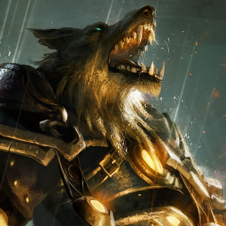

---
{"id":"0d473a60-f2a0-4dd9-8c7b-2ef58670f7ab","title":"Norrix","description":"Norrix Natalis.","isActivePartyMember":true,"isAlive":true,"publish":true,"date_created":"Saturday, January 14th 2023, 10:35:25 am","date_modified":"Friday, April 26th 2024, 11:23:02 pm","editing_lock":false,"live_preview":true,"cssclasses":["mado-heading"],"path":"Tabletop/Campaigns/And A Thousand Years More/Characters/Party/Norrix.md","permalink":"/tabletop/campaigns/and-a-thousand-years-more/characters/party/norrix/","PassFrontmatter":true}
---

## Description

- Full name: "Norrix Natalis"
- Motto: "Hit first and hit hard"
- Jackal Bounty-Hunter
- Be mindful of the Mace

## Mentions

- [[Tabletop/Campaigns/And A Thousand Years More/Sessions/Session 011\|Session 011]]: After the fight, druids walk up and grab [[Tabletop/Campaigns/And A Thousand Years More/Characters/Party/Norrix\|Norrix]]. They shout "Time to sacrifice the winner to the Blood God!"
- [[Tabletop/Campaigns/And A Thousand Years More/Sessions/Session 011\|Session 011]]: [[Tabletop/Campaigns/And A Thousand Years More/Characters/Party/Norrix\|Norrix]] strikes down [[Tabletop/Campaigns/And A Thousand Years More/Characters/Party/Damjan\|Damjan]], winning the match.
- [[Tabletop/Campaigns/And A Thousand Years More/Sessions/Session 011\|Session 011]]: [[Tabletop/Campaigns/And A Thousand Years More/Characters/Party/Norrix\|Norrix]] walks up to [[Tabletop/Campaigns/And A Thousand Years More/Characters/Party/Damjan\|Damjan]], bracing his trusty Mace.
- [[Tabletop/Campaigns/And A Thousand Years More/Sessions/Session 011\|Session 011]]: [[Tabletop/Campaigns/And A Thousand Years More/Characters/Party/Norrix\|Norrix]] dashes and strikes with his claws, as [[Tabletop/Campaigns/And A Thousand Years More/Characters/Party/Damjan\|Damjan]] barely dodges it.
- [[Tabletop/Campaigns/And A Thousand Years More/Sessions/Session 011\|Session 011]]: [[Tabletop/Campaigns/And A Thousand Years More/Characters/Party/Damjan\|Damjan]] recovers and grabs his musket. He shoots, barely missing [[Tabletop/Campaigns/And A Thousand Years More/Characters/Party/Norrix\|Norrix]]\.
- [[Tabletop/Campaigns/And A Thousand Years More/Sessions/Session 011\|Session 011]]: [[Tabletop/Campaigns/And A Thousand Years More/Characters/Party/Norrix\|Norrix]] dashes forwards, shouting "Catch" as he throws a knife, striking [[Tabletop/Campaigns/And A Thousand Years More/Characters/Party/Damjan\|Damjan]].
- [[Tabletop/Campaigns/And A Thousand Years More/Sessions/Session 011\|Session 011]]: [[Tabletop/Campaigns/And A Thousand Years More/Characters/Party/Damjan\|Damjan]] notches an arrow and shoots, barely missing [[Tabletop/Campaigns/And A Thousand Years More/Characters/Party/Norrix\|Norrix]].
- [[Tabletop/Campaigns/And A Thousand Years More/Sessions/Session 011\|Session 011]]: [[Tabletop/Campaigns/And A Thousand Years More/Characters/Party/Norrix\|Norrix]] dashes forward, juggling a knife.
- [[Tabletop/Campaigns/And A Thousand Years More/Sessions/Session 011\|Session 011]]: [[Tabletop/Campaigns/And A Thousand Years More/Characters/Party/Damjan\|Damjan]] aims and shoots the Flame Arrow at [[Tabletop/Campaigns/And A Thousand Years More/Characters/Party/Norrix\|Norrix]] portable wall, hitting it blowing up his wall in the blast. [[Tabletop/Campaigns/And A Thousand Years More/Characters/Party/Norrix\|Norrix]] barely dodges the blast.
- [[Tabletop/Campaigns/And A Thousand Years More/Sessions/Session 011\|Session 011]]: [[Tabletop/Campaigns/And A Thousand Years More/Characters/Party/Norrix\|Norrix]] attempts to lift the portable wall, failing spectacularly. He then tries to taunt [[Tabletop/Campaigns/And A Thousand Years More/Characters/Party/Damjan\|Damjan]], once again, failing spectacularly.
- [[Tabletop/Campaigns/And A Thousand Years More/Sessions/Session 011\|Session 011]]: [[Tabletop/Campaigns/And A Thousand Years More/Characters/Party/Norrix\|Norrix]] dashes forward and braces himself, hiding behind a portable wall.
- [[Tabletop/Campaigns/And A Thousand Years More/Sessions/Session 011\|Session 011]]: [[Tabletop/Campaigns/And A Thousand Years More/Characters/Party/Damjan\|Damjan]] dashes forward and fires his first show with flair, barely missing [[Tabletop/Campaigns/And A Thousand Years More/Characters/Party/Norrix\|Norrix]].
- [[Tabletop/Campaigns/And A Thousand Years More/Sessions/Session 011\|Session 011]]: On [[Tabletop/Campaigns/And A Thousand Years More/Characters/Party/Norrix\|Norrix]] side is a green, hexagonal gemstone.
- [[Tabletop/Campaigns/And A Thousand Years More/Sessions/Session 011\|Session 011]]: Both [[Tabletop/Campaigns/And A Thousand Years More/Characters/Party/Norrix\|Norrix]] and [[Tabletop/Campaigns/And A Thousand Years More/Characters/Party/Damjan\|Damjan]] enter the arena, both noticing several traps on their own side.
- [[Tabletop/Campaigns/And A Thousand Years More/Sessions/Session 011\|Session 011]]: He introcudes [[Tabletop/Campaigns/And A Thousand Years More/Characters/Party/Norrix\|Norrix]] and [[Tabletop/Campaigns/And A Thousand Years More/Characters/Party/Damjan\|Damjan]] as the contestants.
- [[Tabletop/Campaigns/And A Thousand Years More/Sessions/Session 011\|Session 011]]: [[Tabletop/Campaigns/And A Thousand Years More/Characters/Party/Damjan\|Damjan]] walks around the city in his Apothecary Gawn. Everyone is hyped to see him fight [[Tabletop/Campaigns/And A Thousand Years More/Characters/Party/Norrix\|Norrix]].
- [[Tabletop/Campaigns/And A Thousand Years More/Sessions/Session 011\|Session 011]]: [[Tabletop/Campaigns/And A Thousand Years More/Characters/Party/Norrix\|Norrix]] and [[Tabletop/Campaigns/And A Thousand Years More/Characters/Party/Ravahn\|Ravahn]] rob a grave and acquire Fire Mage Apprentice Trappings.
- [[Tabletop/Campaigns/And A Thousand Years More/Sessions/Session 009\|Session 009]]: [[Tabletop/Campaigns/And A Thousand Years More/Characters/Party/Norrix\|Norrix]] gets interrogated by the [[Tabletop/Campaigns/And A Thousand Years More/Faction/Wildt/Wildt Mercenary Guild\|Wildt Mercenary Guild]] with nine others.
- [[Tabletop/Campaigns/And A Thousand Years More/Sessions/Session 009\|Session 009]]: [[Tabletop/Campaigns/And A Thousand Years More/Characters/Party/Norrix\|Norrix]] climbs to the window that [[Tabletop/Campaigns/And A Thousand Years More/Characters/Enemies/Anton\|Anton]] in sleeping on, [[Tabletop/Campaigns/And A Thousand Years More/Characters/Party/Norrix\|he]] makes a lot of noise, throws the sword into the room, heads back the party and explains the preceding events.
- [[Tabletop/Campaigns/And A Thousand Years More/Sessions/Session 009\|Session 009]]: [[Tabletop/Campaigns/And A Thousand Years More/Characters/Party/Lux\|I]] and [[Tabletop/Campaigns/And A Thousand Years More/Characters/Party/Damjan\|Damjan]] stay in the Tavern. [[Tabletop/Campaigns/And A Thousand Years More/Characters/Party/Norrix\|Norrix]] tails the [[Tabletop/Campaigns/And A Thousand Years More/Characters/Enemies/Anton\|gorilla]].
- [[Tabletop/Campaigns/And A Thousand Years More/Sessions/Session 009\|Session 009]]: [[Tabletop/Campaigns/And A Thousand Years More/Characters/Party/Norrix\|Norrix]] convinces me that [[Tabletop/Campaigns/And A Thousand Years More/Characters/Enemies/Ulvar\|Ulvar]] attacked [[Tabletop/Campaigns/And A Thousand Years More/Characters/Party/Norrix\|him]]. I warn the [[Tabletop/Campaigns/And A Thousand Years More/Characters/Enemies/Anton\|gorilla]].
- [[Tabletop/Campaigns/And A Thousand Years More/Sessions/Session 009\|Session 009]]: [[Tabletop/Campaigns/And A Thousand Years More/Characters/Party/Norrix\|Norrix]] swings at [[Tabletop/Campaigns/And A Thousand Years More/Characters/Enemies/Ulvar\|Ulvar]], striking [[Tabletop/Campaigns/And A Thousand Years More/Characters/Enemies/Ulvar\|him]] down in a single strike. Then [[Tabletop/Campaigns/And A Thousand Years More/Characters/Party/Norrix\|he]] kills [[Tabletop/Campaigns/And A Thousand Years More/Characters/Enemies/Ulvar\|Ulvar]] with his own sword and takes his head and sword.
- [[Tabletop/Campaigns/And A Thousand Years More/Sessions/Session 009\|Session 009]]: [[Tabletop/Campaigns/And A Thousand Years More/Characters/Party/Norrix\|Norrix]] shadows [[Tabletop/Campaigns/And A Thousand Years More/Characters/Enemies/Ulvar\|Ulvar]] into a dark alley as [[Tabletop/Campaigns/And A Thousand Years More/Characters/Enemies/Ulvar\|he]] suddenly turns around and grabs his sword.
- [[Tabletop/Campaigns/And A Thousand Years More/Sessions/Session 009\|Session 009]]: [[Tabletop/Campaigns/And A Thousand Years More/Characters/Party/Norrix\|Norrix]] explains what happened to [[Tabletop/Campaigns/And A Thousand Years More/Characters/Party/Lux\|me]].
- [[Tabletop/Campaigns/And A Thousand Years More/Sessions/Session 009\|Session 009]]: [[Tabletop/Campaigns/And A Thousand Years More/Characters/Enemies/Ulvar\|Ulvar]] immediately defeats [[Tabletop/Campaigns/And A Thousand Years More/Characters/Party/Norrix\|Norrix]].
- [[Tabletop/Campaigns/And A Thousand Years More/Sessions/Session 009\|Session 009]]: [[Tabletop/Campaigns/And A Thousand Years More/Characters/Party/Norrix\|Norrix]] heads to the [[Tabletop/Campaigns/And A Thousand Years More/Location/Towns and Cities/Wildt/Wildt's Mercenary Guild Building\|Mercenary Guild]] to fight for the champion spot. A mean looking bear, named [[Tabletop/Campaigns/And A Thousand Years More/Characters/Enemies/Ulvar\|Ulvar]], is the prospective champion. [[Tabletop/Campaigns/And A Thousand Years More/Characters/Party/Norrix\|Norrix]] challenges him for the spot.
- [[Tabletop/Campaigns/And A Thousand Years More/Sessions/Session 009\|Session 009]]: [[Tabletop/Campaigns/And A Thousand Years More/Characters/Party/Norrix\|Norrix]] sells his [[Tabletop/Campaigns/And A Thousand Years More/Inventory/Equipment/Chainmail\|excess equipment]] for 110 Denari.
- [[Tabletop/Campaigns/And A Thousand Years More/Sessions/Session 009\|Session 009]]: [[Tabletop/Campaigns/And A Thousand Years More/Characters/Party/Norrix\|Norrix]] and [[Tabletop/Campaigns/And A Thousand Years More/Characters/Party/Lux\|I]] walks up to the [[Tabletop/Campaigns/And A Thousand Years More/Location/Towns and Cities/Wildt/Wildt's Armory\|armorer]], looking to sell some excess equipment. [[Tabletop/Campaigns/And A Thousand Years More/Characters/Party/Norrix\|Norrix]] throws all of his excess equipment on the counter.
- [[Tabletop/Campaigns/And A Thousand Years More/Sessions/Session 009\|Session 009]]: There is an selection fight to decide the [[Tabletop/Campaigns/And A Thousand Years More/Faction/Wildt/Wildt Mercenary Guild\|guild]] champion for the [[Tabletop/Campaigns/And A Thousand Years More/Location/Towns and Cities/Wildt/Wildt's Fair\|event]]. [[Tabletop/Campaigns/And A Thousand Years More/Characters/Party/Norrix\|Norrix]] decides to participate.
- [[Tabletop/Campaigns/And A Thousand Years More/Sessions/Session 009\|Session 009]]: [[Tabletop/Campaigns/And A Thousand Years More/Characters/Party/Norrix\|Norrix]] enters the [[Tabletop/Campaigns/And A Thousand Years More/Location/Towns and Cities/Wildt/Wildt's Mercenary Guild Building\|Mercenary Guild]], looking to participate in the [[Tabletop/Campaigns/And A Thousand Years More/Location/Towns and Cities/Wildt/Wildt's Fair\|event]].
- [[Tabletop/Campaigns/And A Thousand Years More/Sessions/Session 009\|Session 009]]: [[Tabletop/Campaigns/And A Thousand Years More/Characters/Party/Damjan\|Damjan]] and [[Tabletop/Campaigns/And A Thousand Years More/Characters/Party/Norrix\|Norrix]] both decide to participate in the in the second round.
- [[Tabletop/Campaigns/And A Thousand Years More/Sessions/Session 009\|Session 009]]: [[Tabletop/Campaigns/And A Thousand Years More/Characters/Party/Norrix\|Norrix]] also shows his [[Tabletop/Campaigns/And A Thousand Years More/Inventory/Misc/Red Level Guild Badge\|Red Level Guild Badge]].
- [[Tabletop/Campaigns/And A Thousand Years More/Sessions/Session 009\|Session 009]]: After failing to be selected as the [[Tabletop/Campaigns/And A Thousand Years More/Faction/Wildt/Wildt Mercenary Guild\|Mercenary]] Champion, [[Tabletop/Campaigns/And A Thousand Years More/Characters/Party/Norrix\|Norrix]] manages to frame his [[Tabletop/Campaigns/And A Thousand Years More/Characters/Enemies/Anton\|rival]] for [[Tabletop/Campaigns/And A Thousand Years More/Characters/Enemies/Ulvar\|murder he committed]].
- [[Tabletop/Campaigns/And A Thousand Years More/Sessions/Session 009\|Session 009]]: [[Tabletop/Campaigns/And A Thousand Years More/Characters/Party/Norrix\|Norrix]] and [[Tabletop/Campaigns/And A Thousand Years More/Characters/Party/Damjan\|Damjan]] decide to participate in the [[Tabletop/Campaigns/And A Thousand Years More/Location/Towns and Cities/Wildt/Wildt's Fair\|event]].
- [[Tabletop/Campaigns/And A Thousand Years More/Sessions/Session 008\|Session 008]]: [[Tabletop/Campaigns/And A Thousand Years More/Characters/Party/Norrix\|Norrix]] ransacks the [[Tabletop/Campaigns/And A Thousand Years More/Location/Towns and Cities/Wildt/Manor of Muroliva\|place]], one book he tosses falls open and reveals a hidden [[Tabletop/Campaigns/And A Thousand Years More/Inventory/Misc/Black Leather Tome\|Black Leather Tome]]. It is clearly about Necromancy. **It is forbidden knowledge.**
- [[Tabletop/Campaigns/And A Thousand Years More/Sessions/Session 003\|Session 003]]: [[Tabletop/Campaigns/And A Thousand Years More/Characters/Party/Lux\|I]] watch as [[Tabletop/Campaigns/And A Thousand Years More/Characters/Party/Norrix\|Norrix]] and [[Tabletop/Campaigns/And A Thousand Years More/Characters/Party/Damjan\|Damjan]] make quick work of the [[Tabletop/Campaigns/And A Thousand Years More/Bestiary/Plantlike/Punching Onion\|Onions]].
- [[Tabletop/Campaigns/And A Thousand Years More/Sessions/Session 003\|Session 003]]: [[Tabletop/Campaigns/And A Thousand Years More/Characters/Party/Norrix\|Norrix]] grins "Good."
- [[Tabletop/Campaigns/And A Thousand Years More/Sessions/Session 003\|Session 003]]: [[Tabletop/Campaigns/And A Thousand Years More/Characters/Enemies/Eckart\|He]] continues "So I want you to do [[Tabletop/Campaigns/And A Thousand Years More/Quests/Completed/Clear the Farms of Punching Onions\|something else]] for me first." He turns his gaze to [[Tabletop/Campaigns/And A Thousand Years More/Characters/Party/Damjan\|Damjan]] and [[Tabletop/Campaigns/And A Thousand Years More/Characters/Party/Norrix\|Norrix]] "And rest assured, you will be well compensated for your endeavors."
- [[Tabletop/Campaigns/And A Thousand Years More/Sessions/Session 003\|Session 003]]: [[Tabletop/Campaigns/And A Thousand Years More/Characters/Party/Norrix\|Norrix]] nods in agreement. "For a price."
- [[Tabletop/Campaigns/And A Thousand Years More/Sessions/Session 002\|Session 002]]: [[Tabletop/Campaigns/And A Thousand Years More/Characters/Party/Morale\|Morale]] flies up and dives towards the [[Tabletop/Campaigns/And A Thousand Years More/Faction/Opeden/Bandits of Opeden\|bandit in the back]]. [[Tabletop/Campaigns/And A Thousand Years More/Characters/Party/Norrix\|Norrix]] charges in as [[Tabletop/Campaigns/And A Thousand Years More/Characters/Party/Damjan\|Damjan]] notches an arrow.
- [[Tabletop/Campaigns/And A Thousand Years More/Sessions/Session 002\|Session 002]]: [[Tabletop/Campaigns/And A Thousand Years More/Characters/Party/Norrix\|Norrix]] walks back to the bar as [[Tabletop/Campaigns/And A Thousand Years More/Characters/Party/Damjan\|Damjan]] ponders. "A free ride and a [[Tabletop/Campaigns/And A Thousand Years More/Characters/Allies/Leon\|potential ally]]. Hmm." [[Tabletop/Campaigns/And A Thousand Years More/Characters/Party/Damjan\|Damjan]] thinks out loud. "Alright. [[Tabletop/Campaigns/And A Thousand Years More/Faction/Misc/Party\|We]]'ll see what we can do."
- [[Tabletop/Campaigns/And A Thousand Years More/Sessions/Session 002\|Session 002]]: "How much does [[Tabletop/Campaigns/And A Thousand Years More/Quests/Completed/Defeat the Bandits\|it]] pay?" [[Tabletop/Campaigns/And A Thousand Years More/Characters/Party/Norrix\|Norrix]] asks.
- [[Tabletop/Campaigns/And A Thousand Years More/Sessions/Session 002\|Session 002]]: [[Tabletop/Campaigns/And A Thousand Years More/Characters/Party/Lux\|I]] pull [[Tabletop/Campaigns/And A Thousand Years More/Characters/Party/Damjan\|Damjan]] and [[Tabletop/Campaigns/And A Thousand Years More/Characters/Party/Norrix\|Norrix]] from the bar. "[[Tabletop/Campaigns/And A Thousand Years More/Quests/Completed/Defeat the Bandits\|I found a quest]]."
- [[Tabletop/Campaigns/And A Thousand Years More/Sessions/Session 001\|Session 001]]: [[Tabletop/Campaigns/And A Thousand Years More/Characters/Party/Lux\|I]] look back to the ring to see how the others are doing. [[Tabletop/Campaigns/And A Thousand Years More/Characters/Party/Norrix\|Norrix]] seems to have defeated the gorilla spectacularly. Meanwhile [[Tabletop/Campaigns/And A Thousand Years More/Characters/Party/Damjan\|Damjan]] is counting his returns on the bet.
- [[Tabletop/Campaigns/And A Thousand Years More/Sessions/Session 001\|Session 001]]: [[Tabletop/Campaigns/And A Thousand Years More/Characters/Party/Damjan\|Damjan]] looks at [[Tabletop/Campaigns/And A Thousand Years More/Characters/Party/Norrix\|Norrix]] and nods, and [[Tabletop/Campaigns/And A Thousand Years More/Characters/Party/Norrix\|Norrix]] nods back. Shortly after [[Tabletop/Campaigns/And A Thousand Years More/Characters/Party/Norrix\|Norrix]] enters the ring as [[Tabletop/Campaigns/And A Thousand Years More/Characters/Party/Damjan\|Damjan]] bets money on his victory.
- [[Tabletop/Campaigns/And A Thousand Years More/Sessions/Session 001\|Session 001]]: [[Tabletop/Campaigns/And A Thousand Years More/Characters/Party/Norrix\|Norrix]] wrestled a gorilla and won.

