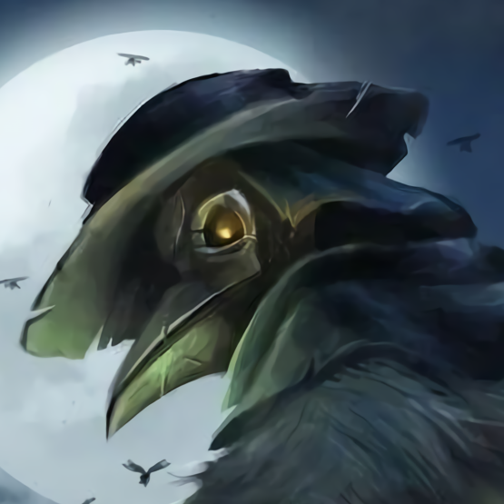

---
{"id":"b4bab88f-3733-4e33-8670-db2f3335a629","title":"Ravahn","description":"Cornelius Ravahn.","isActivePartyMember":true,"isAlive":true,"publish":true,"date_created":"Saturday, January 14th 2023, 10:36:53 am","date_modified":"Friday, April 26th 2024, 11:23:02 pm","editing_lock":false,"live_preview":true,"cssclasses":["mado-heading"],"PassFrontmatter":true}
---

## Description

- Full name: Cornelius Ravahn
- Motto: "Verbeter je lot met een pil door je strot!"
- Raven Almoner
- Plague Doctor Student

## Mentions

- [[Tabletop/Campaigns/And A Thousand Years More/Sessions/Session 011\|Session 011]]: [[Tabletop/Campaigns/And A Thousand Years More/Characters/Party/Norrix\|Norrix]] and [[Tabletop/Campaigns/And A Thousand Years More/Characters/Party/Ravahn\|Ravahn]] rob a grave and acquire Fire Mage Apprentice Trappings.
- [[Tabletop/Campaigns/And A Thousand Years More/Sessions/Session 008\|Session 008]]: [[Tabletop/Campaigns/And A Thousand Years More/Faction/Misc/Party\|We]] find a [[Tabletop/Campaigns/And A Thousand Years More/Inventory/Equipment/Tomb Tree Rod\|Tomb Tree Rod]] and a [[Tabletop/Campaigns/And A Thousand Years More/Inventory/Equipment/Darkwood Wand\|Darkwood Wand]]. [[Tabletop/Campaigns/And A Thousand Years More/Characters/Party/Ravahn\|Ravahn]] identifies them to be used for Necromancy.
- [[Tabletop/Campaigns/And A Thousand Years More/Sessions/Session 008\|Session 008]]: [[Tabletop/Campaigns/And A Thousand Years More/Characters/Party/Ravahn\|Ravahn]] suspects that the howling sounds come from a [[Tabletop/Campaigns/And A Thousand Years More/Bestiary/Undead/Tomb Tree\|Tomb Tree]].
- [[Tabletop/Campaigns/And A Thousand Years More/Sessions/Session 008\|Session 008]]: [[Tabletop/Campaigns/And A Thousand Years More/Characters/Party/Ravahn\|Ravahn]] flips through the [[Tabletop/Campaigns/And A Thousand Years More/Inventory/Misc/Black Leather Tome\|Necromancy Tome]]. It reveals a lot of information about [[Tabletop/Campaigns/And A Thousand Years More/Bestiary/Undead/Skeleton\|Skeletons]] and [[Tabletop/Campaigns/And A Thousand Years More/Bestiary/Undead/Zombie\|Zombies]], as well as basic curses.

